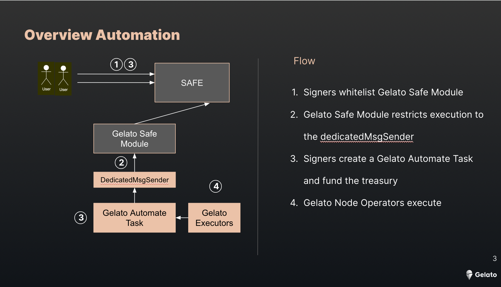

# Gelato Automate Safe transactions


<a href="https://youtu.be/Auhz3WRNoAg" target="_blank">
 
</a>

## Summary

An example implementation of a Gelato Safe Module which you can use to automate transactions using a Safe proxy. This enables cool use cases such as building yield farming protocols that dont have to pool funds, but rather use funds that are under custody of the user's Safe. 

In this repo we will show two use cases:
- Recurring payment from a DAO to a contributor
- Deferring a transaction execution to a predefined point in time.


**Note:** This code is currently unaudited, please don't use this in production. If you are interested in building on top of this, feel free to reach out to us on [discord](https://discord.gg/ApbA39BKyJ). 


## How to automate transactions using your Safe

These are the steps required to automate your Safe executions:

1. Create a Safe module and whitelist it in your Safe
2. Gelato restricts execution to allow only dedicatedMsgSender
3. Call the `createTask` function on [Gelato Automate](https://github.com/gelatodigital/ops/blob/ea4f0dcb023861bce9ebf0840460b674cae04874/contracts/Ops.sol#L46) using your Safe as the `msg.sender` to tell Gelato to start automating your desired actions and Deposit some network token (e.g. ETH on Ethereum) into Gelato's [TaskTreasury](https://github.com/gelatodigital/ops/blob/ea4f0dcb023861bce9ebf0840460b674cae04874/contracts/TaskTreasury/TaskTreasuryUpgradable.sol#L136) to pay for transactions
4. Done! Gelato will start automating your desired actions using your Safe when the conditions you defined are met. 


<a href="https://docs.google.com/presentation/d/1U4CBrtCWFItumSNfN4ZQu5-d2leVsyhUNmDAyKBOgxw/edit?usp=sharing"></a>

## Examples

We are going to use locally a safe mock with basic functionallity TestAvatar.sol.

### DAO recurring payment to a contributor

```
    const data = await avatar.interface.encodeFunctionData("execTransaction", [
      contributorAddress,
      payment,
      "0x",
      CALL,
    ]);

    const gelatoSafeModuleData = gelatoSafeModule.interface.encodeFunctionData("execute", [
      avatar.address,
      [
        {
          to: avatar.address,
          data: data,
          value: 0,
          operation: CALL,
        },
      ],
    ]);

    const startTime = (await getTimeStampNow()) + INTERVAL;

    const modules: Module[] = [Module.TIME, Module.PROXY];
```

### Deferring a transaction execution to a predefined point in time.

```
    const execData = counter.interface.encodeFunctionData("increaseCount", [1]);
    const gelatoSafeModuleData = gelatoSafeModule.interface.encodeFunctionData("execute", [
      avatar.address,
      [
        {
          to: counter.address,
          data: execData,
          value: 0,
          operation: CALL,
        }
      ],
    ]);

    const delay = 6 * 60 * 60 * 1000 //// six hours
    const startTime = (await getTimeStampNow()) + delay;

    const modules: Module[] = [Module.TIME, Module.PROXY, Module.SINGLE_EXEC];
```


## Run tests

1. `cp .env.example .env // => fill this in`
2. `yarn`
3. `yarn test`